# INPTPlay - Réservation de Terrains Sportifs

INPTPlay est une application web permettant aux étudiants de l'INPT de réserver facilement des terrains de sport, incluant le football, le basketball et le volleyball. L'application offre une interface utilisateur intuitive pour gérer les réservations, annuler des créneaux, et améliorer l'accès aux installations sportives de l'université.

## Fonctionnalités

- Réservation en ligne des terrains de football, basketball et volleyball
- Interface utilisateur conviviale et réactive
- Gestion des créneaux horaires disponibles et réservés
- Annulation des réservations
- Section de suggestions pour améliorer les services
- Un Admin Panel de INPTPlay qui permet aux administrateurs de surveiller les activités de réservation des terrains de sport.

## Technologies Utilisées

- **Frontend**: HTML, CSS, JavaScript, Bootstrap
- **Backend**: Java (JSP, Servlets)
- **Base de Données**: MySQL
- **Gestion des Dépendances**: Maven

# Fonctionnalités de INPTPlay

INPTPlay est une application web qui permet aux étudiants de l'INPT de réserver facilement des terrains de sport. Voici une description des principales fonctionnalités de l'application :

## 1. Page d'Accueil

La page d'accueil présente une vue d'ensemble de l'application et de ses fonctionnalités. Les utilisateurs peuvent accéder à différentes sections depuis le menu de navigation.

**Capture d'écran : Page d'Accueil**

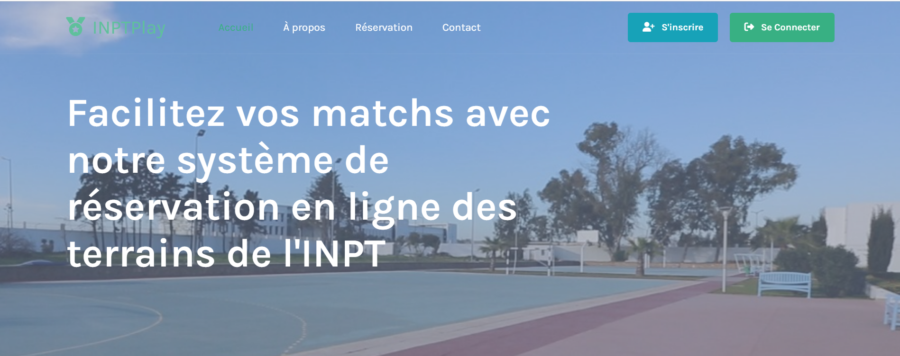

## 2. Inscription et Connexion

Les utilisateurs peuvent créer un compte et se connecter pour accéder aux fonctionnalités de réservation.

- **Inscription** : Les nouveaux utilisateurs peuvent créer un compte en fournissant leur nom, email, mot de passe et autres informations nécessaires.
- **Connexion** : Les utilisateurs existants peuvent se connecter en utilisant leur nom d'utilisateur et mot de passe.

**Capture d'écran : Page d'Inscription**

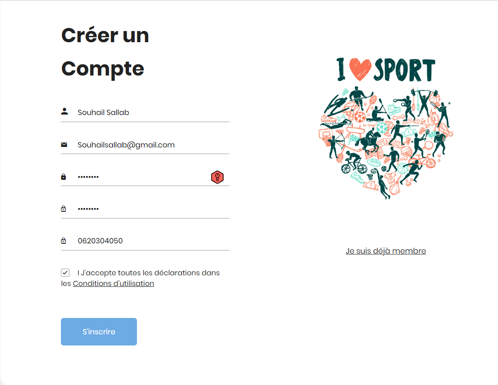

**Capture d'écran : Utilisateur Inscrit avec succès**

**Capture d'écran : Page de Connexion**

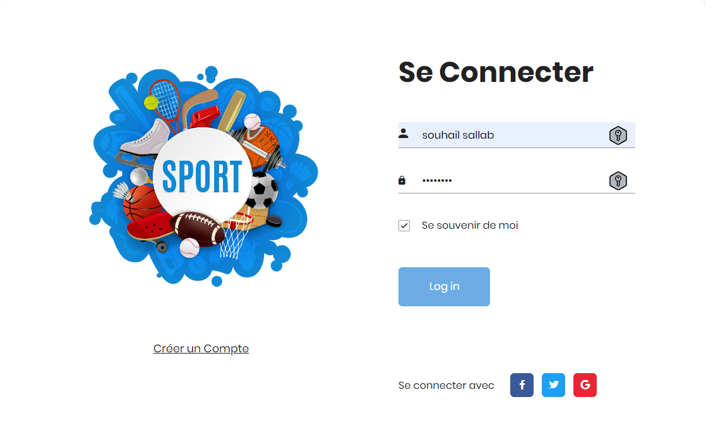

## 3. Réservation de Terrains

Les utilisateurs peuvent réserver des terrains de football, basketball et volleyball en sélectionnant la date, l'heure et le type de sport. Les créneaux disponibles et réservés sont clairement affichés.

**Capture d'écran : Section du choix de Terrain**

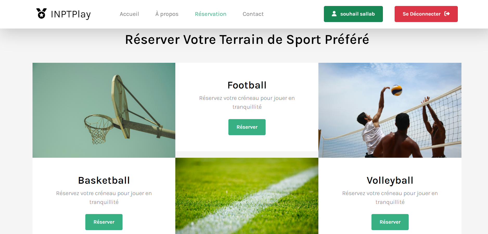

**Capture d'écran : Page de Réservation**

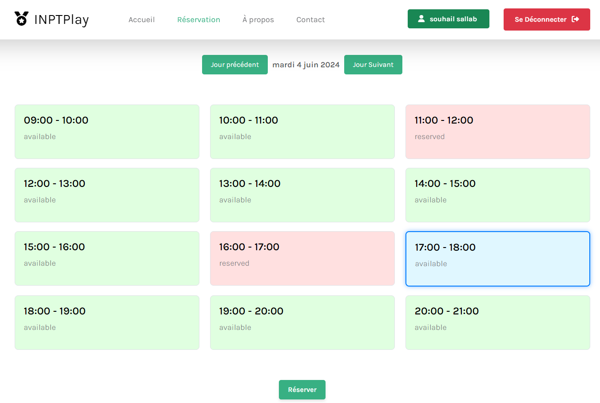

**Capture d'écran : Réservation Validée**

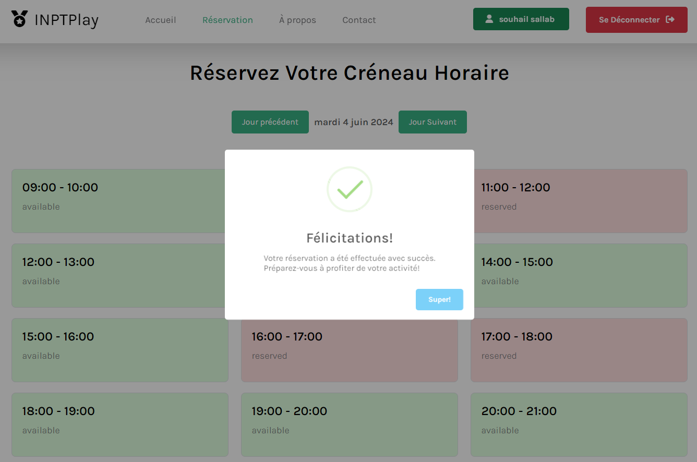

## 4. Gestion des Réservations

Les utilisateurs peuvent consulter leurs réservations actuelles et annuler celles qu'ils ne peuvent plus honorer.

**Capture d'écran : Page de Gestion des Réservations**

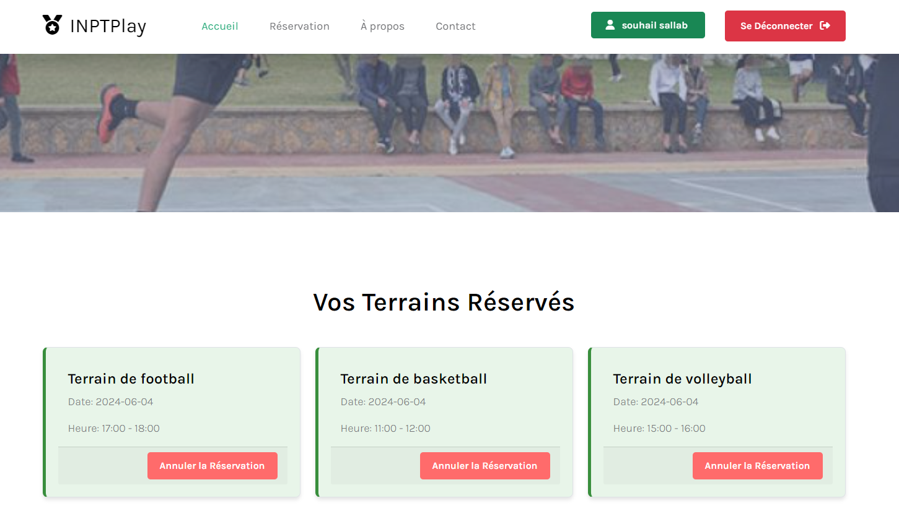

**Capture d'écran : Annuler une Réservations**

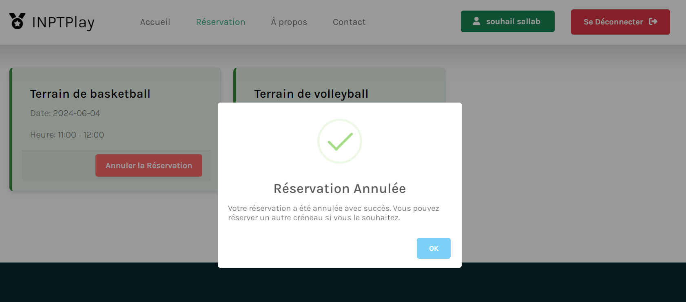

## 5. Section de Suggestions

Une section est dédiée aux suggestions des utilisateurs pour améliorer les services offerts. Les utilisateurs peuvent soumettre leurs idées et commentaires.

**Capture d'écran : Section de Suggestions**
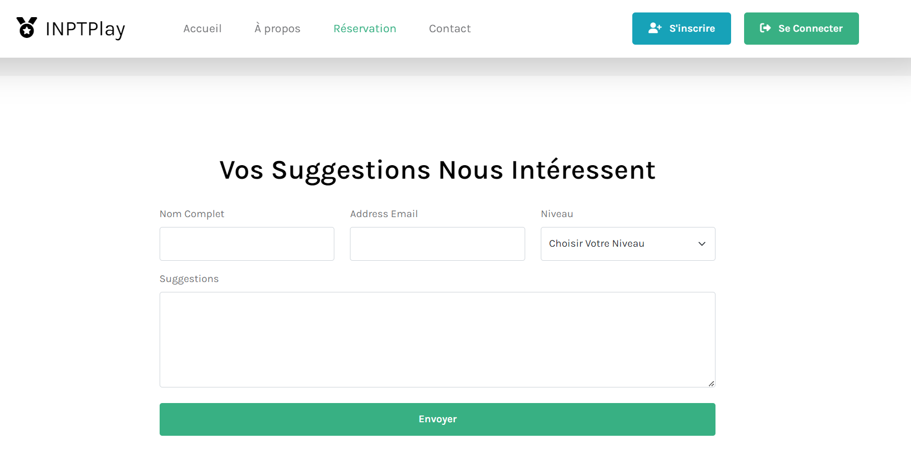

# Fonctionnalités du Admin Panel - INPTPlay

L'Admin Panel de INPTPlay permet aux administrateurs de gérer et de surveiller les activités de réservation des terrains de sport. Voici une description des principales fonctionnalités de l'admin panel :

## 1. Tableau de Bord

Le tableau de bord offre une vue d'ensemble rapide des principales statistiques de l'application. 

- **Nombre d'élèves inscrits** : Affiche le nombre total d'élèves inscrits sur la plateforme.
- **Nombre de réservations de terrains de sport** : Affiche le nombre total de réservations pour les terrains de football, basketball et volleyball.

**Capture d'écran : Tableau de Bord**

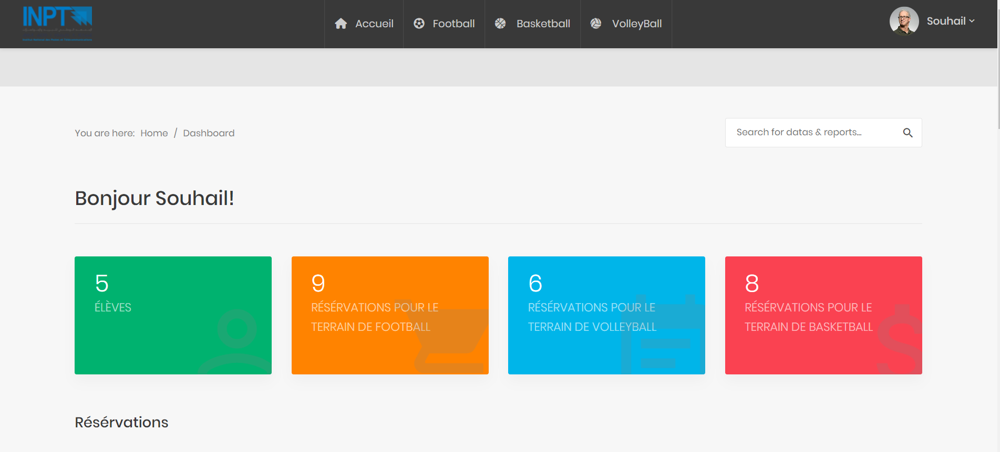

## 2. Visualisation des Réservations

Les administrateurs peuvent visualiser toutes les réservations effectuées sur la plateforme.

- **Voir les réservations** : Affiche une liste détaillée de toutes les réservations.

**Capture d'écran : Voir des Réservations**

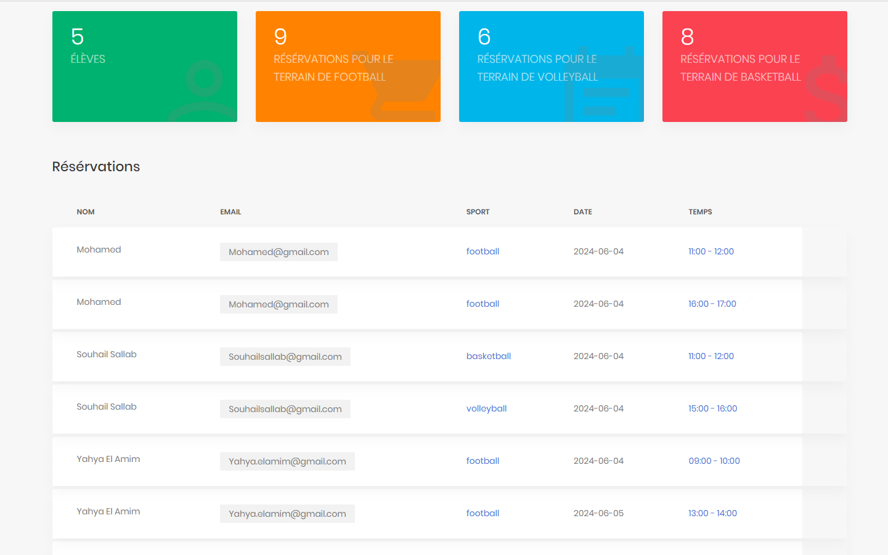

**Capture d'écran : Voir des Réservations par Sport**

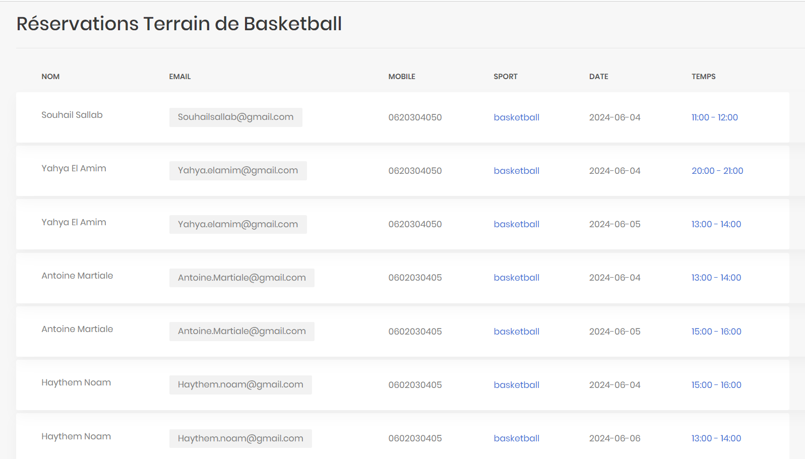

# Contributeurs

Merci aux personnes suivantes qui ont contribué à ce projet :

- [**ANTOINE Ahehehinnou Matial**](https://github.com/antoineahehehinnou)
- [**ELAMIM Yahya**](https://github.com/yahyaelamim)
- [**NOAM Haythem**](https://github.com/noamgates)
- [**SALLAB Souhail**](https://github.com/SallabSouhail)

